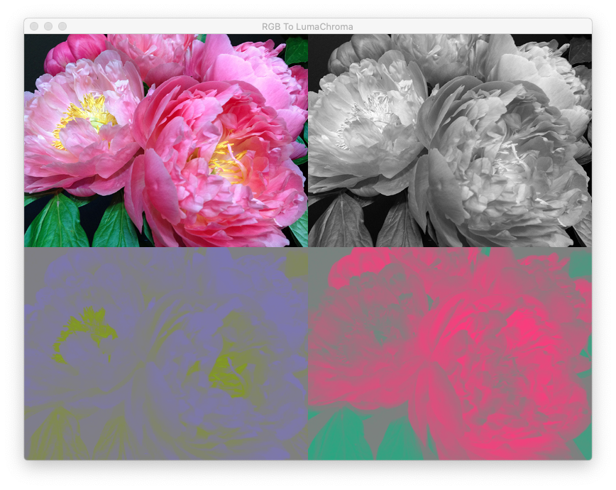
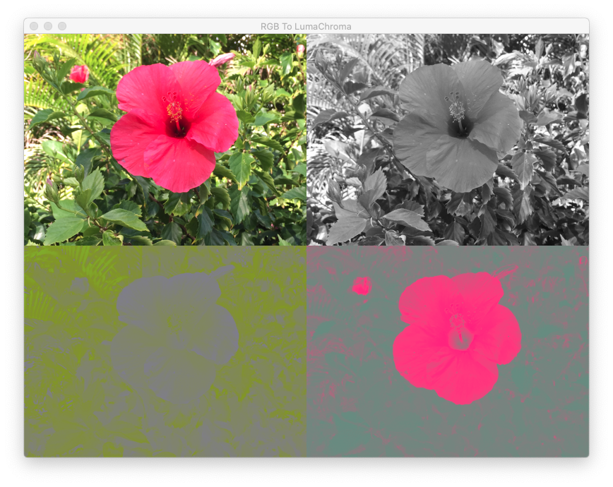

## Using Metal Shaders to convert an RGB graphic to 3 separate images in yCbCr color space.
 
 
 

The demo **LumaChromaRGBConversions** attempts to separate an RGB image into 3 channels: luminance (luma), chrominance blue (Chroma-blue) difference and chrominance red difference (Chroma-red).

It creates pseudo (false) coloured image for the chroma-blue and chroma-red textures and a gray scale image for the luminance texture.

The user can save all 3 textures to a default folder named "textures". He/She is allowed to specify another folder name. The sizes of both chroma textures are 1/4 the size of the luma texture.

 
 

When the input graphic is "Flower_2.jpg", the expected output is:

 
 

When the input graphic is "RedFlower.png", the expected output is:

### Development Platform

XCode 11.6 running on macOS 10.15

The source code can be ported back to older versions of macOS.

 
 

**Reference:** Understanding YpCbCr Image Formats 

### Weblinks:

https://stackoverflow.com/questions/57348166/metal-rgb-to-yuv-conversion-compute-shader

https://stackoverflow.com/questions/58175811/how-to-convert-an-rgba-texture-to-y-and-cbcr-textures-in-metal

https://onlinepngtools.com/convert-png-to-ycbcr-colors

https://stackoverflow.com/questions/74158097/how-to-display-colored-y-cb-cr-channels-in-python-opencv

